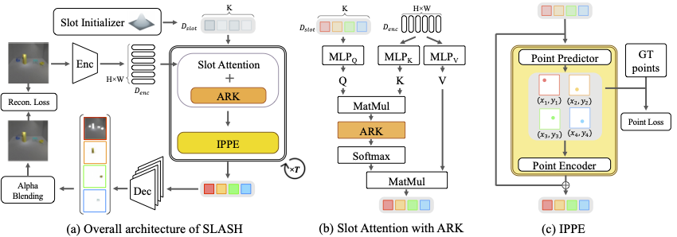

# SLASH (SLot Attention via SHepherding)
This is the official implementation of “[Shepherding Slots to Objects: Towards Stable and Robust Object-Centric Learning](https://arxiv.org/abs/2303.17842)” published in [*CVPR 2023*](https://cvpr2023.thecvf.com).



For the implementation of the baseline methods, see [here](https://github.com/janghyuk-choi/slot-attention-lightning).

---

## Installation

This repo is developed based on [*Python 3.7.11*](https://www.python.org/downloads/release/python-3711/) and [*PyTorch 1.10.0*](https://pytorch.org/get-started/previous-versions/#v1100).

```bash
# [optional] set a virtual environment
conda create -n slash python=3.7 -y
conda activate slash
conda install pytorch==1.10.0 torchvision==0.11.0 -c pytorch -y

# clone the repo and install additional requirements
git clone https://github.com/object-understanding/SLASH.git
cd SLASH
pip install -r requirements.txt
```

### Requirements:

- [*pycocotools*](https://pypi.org/project/pycocotools/2.0.4/) to decode mask annotations in [*PTR*](https://github.com/evelinehong/PTR) dataset.
- [*scipy*](https://pypi.org/project/scipy/1.7.3/) to compute evaluation metrics.
- [*tensorboard*](https://pypi.org/project/tensorboard/2.10.0/) to log tranining results.


---

## Repository Structure

```
├── configs
│   ├── CLEVR6                          <- configs for CLEVR6
│   │   ├── SLASH_0.1_0.75_clv6.yaml    <- config for SLASH on CLEVR6
│   │   └── ...
│   ├── ...                             <- configs for other datasets
│   └── SA_base.yaml                    <- Base configuration
│
├── data                <- Directory for dataset
│   └── CLEVR6
│       ├── supervision_splits.json      <- to split dataset for semi supervision
│       ├── images      <- to include raw images
│       │   ├── train
│       │   │   ├── CLEVR_train_******.png
│       │   │   └── ...
│       │   └── val
│       │       ├── CLEVR_val_******.png
│       │       └── ...
│       ├── masks       <- to include annotations
│       │   ├── train
│       │   │   ├── CLEVR_train_******.png
│       │   │   └── ...
│       │   └── val
│       │       ├── CLEVR_val_******.png
│       │       └── ...
│       └── scenes      <- to include metadata about the dataset
│           ├── CLEVR_train_scenes.json
│           └── CLEVR_val_scenes.json
│
├── output_dir                      <- to save output results
│   └── SLASH_0.1_0.75_clv6         <- training results by SLASH on CLEVR6
│       ├── checkpoint-latest.pth   <- the latset checkpoint
│       ├── ...
│       └── events.out.tfevents.*   <- tensorboard log file
│
├── utils
│   ├── __init__.py
│   ├── config.py           <- to handle configs
│   ├── evaluator.py        <- to compute evaluation metrics
│   └── vutil.py            <- to visualize model outputs
│
├── datasets.py             <- dataset classes
├── eval_metric.py          <- script to evaluate a checkpoint
├── model.py                <- all necessary model components
├── requirements.txt        <- file for installing python dependencies
├── .gitignore
├── README.md
└── LICENSE
```
> **Note**  
> 1. Each dataset may have a different way of providing mask annotation and metadata, so you should match the `Dataset` class for each dataset with its configuration.
> 2. You can download `supervision_splits.json` files [here](https://drive.google.com/drive/folders/1icD7MBAOOBuG09-4auA8h0IAsXmlNzI1?usp=sharing).

---

## Training

### Training SLASH from scratch on CLEVR6

```bash
python train.py \
--config_file configs/CLEVR6/SLASH_0.1_0.75_clv6.yaml \
--data_dir data/CLEVR6 \
--batch_size 64 \
--num_workers 4 \
--eval_interval 100
```

### Resume training SLASH from the latest checkpoint, if it exists, on CLEVR6

```bash
python train.py \
--config_file configs/CLEVR6/SLASH_0.1_0.75_clv6.yaml \
--data_dir data/CLEVR6 \
--batch_size 64 \
--num_workers 4 \
--eval_interval 100 \
--resume_ckpt output_dir/SLASH_0.1_0.75_clv6/checkpoint-latest.pth
```

---

## Evaluation

checkpoints will be available soon. (we are under code refactoring)
<!--
[[checkpoints](https://drive.google.com/file/d/1K6obkakAJPZbMSr33LcjLHLBLbFIZHOn/view?usp=share_link)]
-->

```bash
# evaluate SLASH on CLEVR6 dataset
# here `output_dir` is a path to save a txt file of a evaluation result
# so it can differ from the path for a checkpoint
python eval_metric.py \
--config_file configs/CLEVR6/SLASH_0.1_0.75_clv6.yaml \
--data_dir data/CLEVR6/ \
--batch_size 64 \
--num_workers 4 \
--output_dir output_dir/SLASH_0.1_0.75_clv6/ \
--checkpoint output_dir/SLASH_0.1_0.75_clv6/checkpoint-latest.pth
```

---

## Acknowledgements

<details>
<summary>We appreciate the following open source projects:</summary>
<div markdown="1">

- [Slot Attention](https://github.com/google-research/google-research/tree/master/slot_attention) (Apache License 2.0)
- [Slot Attention in PyTorch](https://github.com/evelinehong/slot-attention-pytorch)
- [SLATE](https://github.com/singhgautam/slate) (MIT License)
- [Multi-Object Datasets](https://github.com/deepmind/multi_object_datasets) (Apache License 2.0)
- [Kubric](https://github.com/google-research/kubric) (Apache License 2.0)
- [ClevrTex](https://github.com/karazijal/clevrtex) (BSD-3-Clause license)
- [PTR](https://github.com/evelinehong/PTR) (MIT license)
</div>
</details>

---

## Citation
```
@misc{kim2023shepherding,
      title={Shepherding Slots to Objects: Towards Stable and Robust Object-Centric Learning}, 
      author={Jinwoo Kim and Janghyuk Choi and Ho-Jin Choi and Seon Joo Kim},
      year={2023},
      eprint={2303.17842},
      archivePrefix={arXiv},
      primaryClass={cs.CV}
}
```
